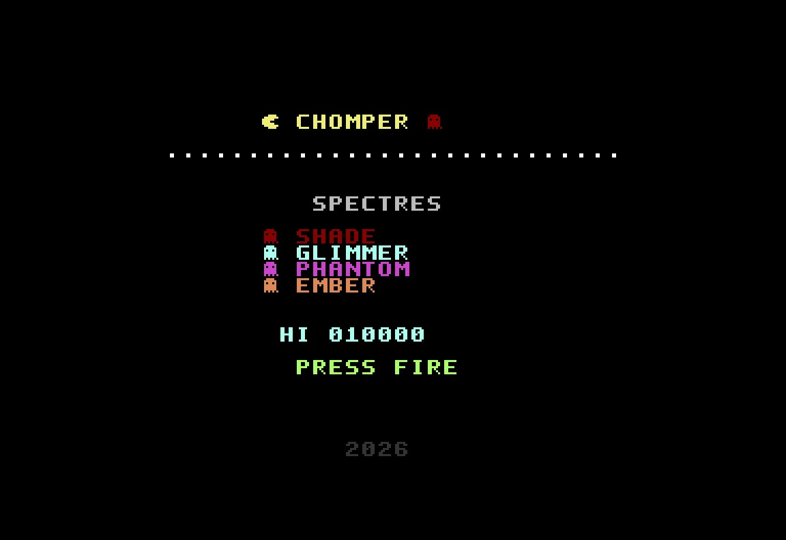
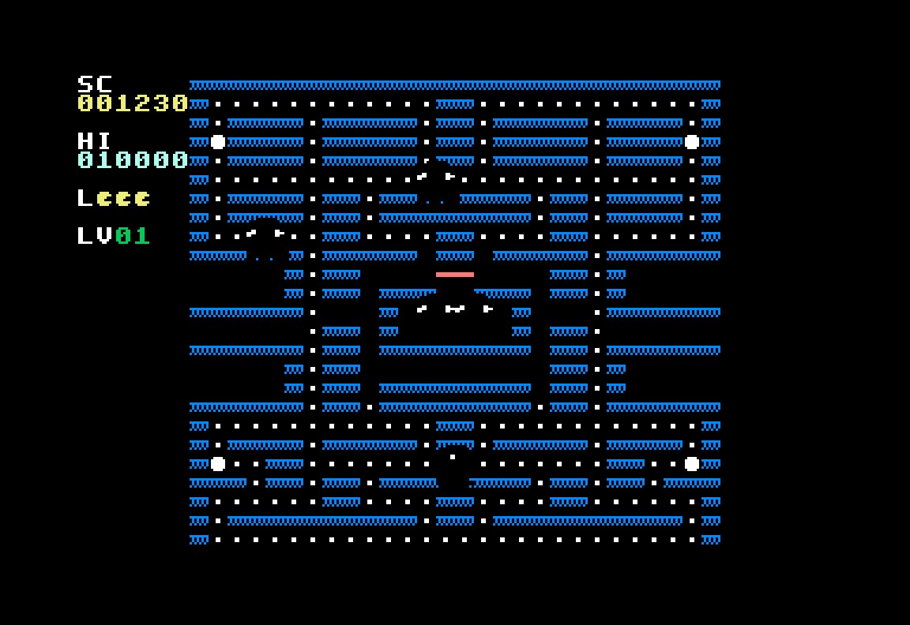
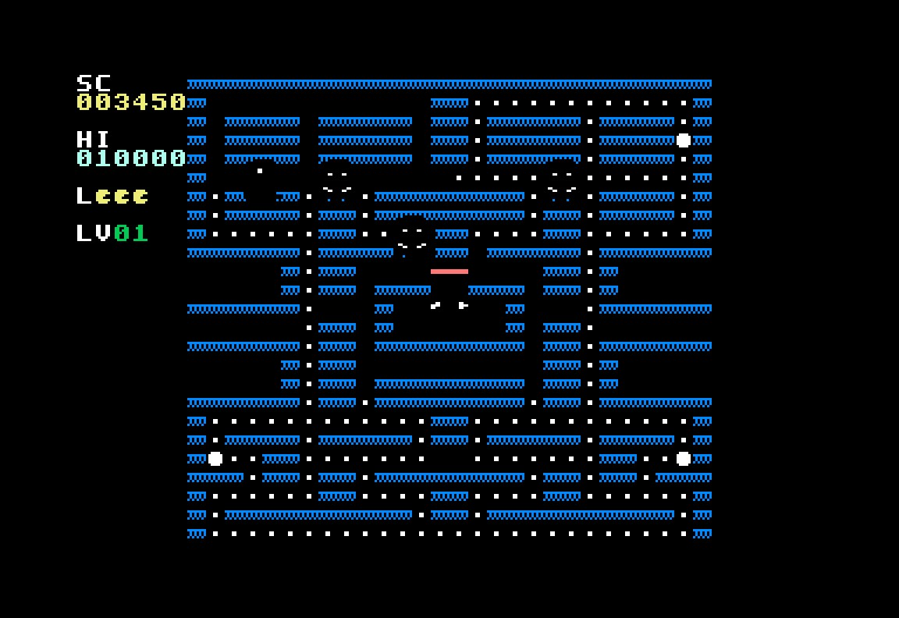
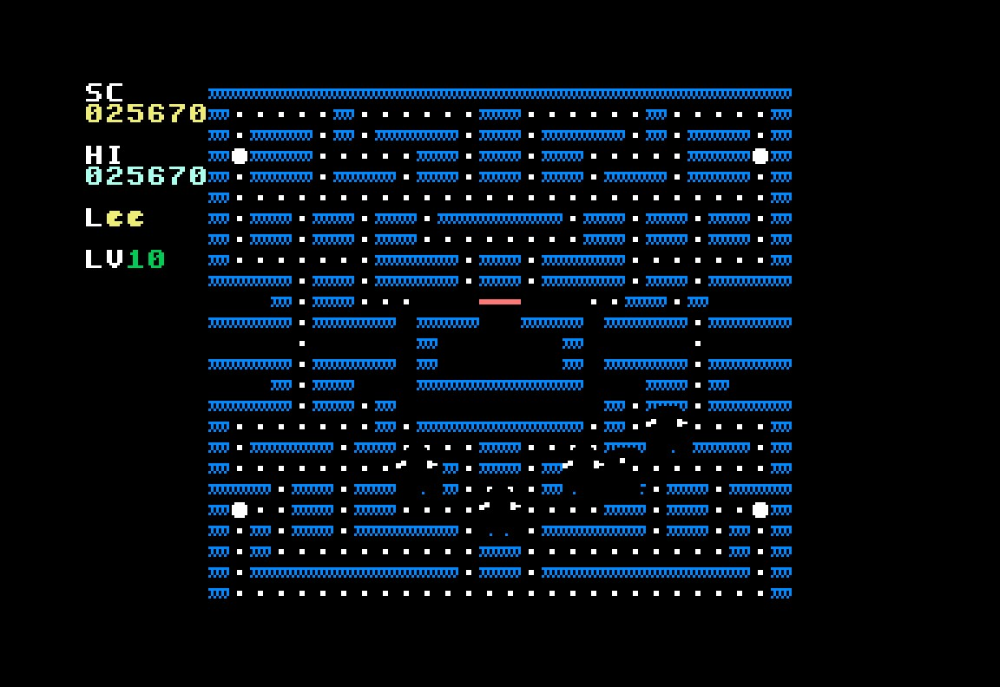
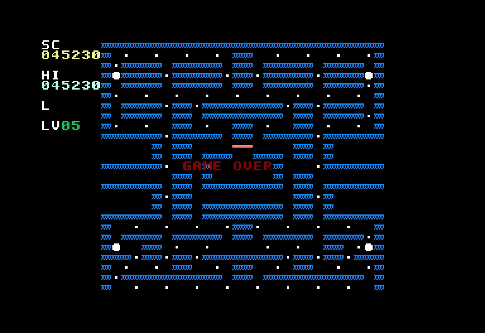
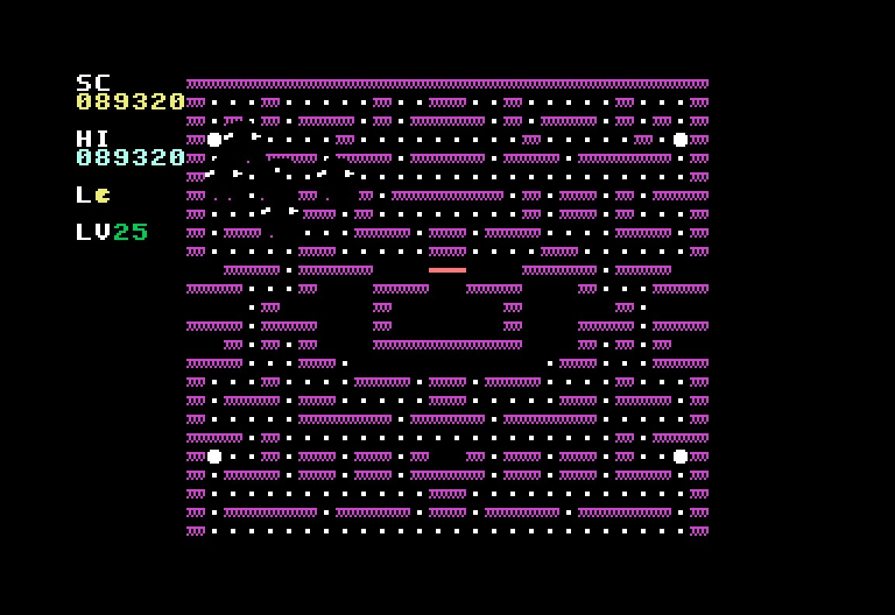

# CHOMPER

### A Pac-Man Style Maze Game for the Commodore 64



---

## Overview

**CHOMPER** is a complete maze-chase game written in 6502 assembly language for the Commodore 64. It features an original cast of characters, 30 progressively difficult levels, four unique enemy AI behaviors, and a full SID chip soundtrack — all squeezed into the C64's 64KB of RAM using every hardware trick in the book.

You play as **Chomper**, a hungry cosmic worm navigating labyrinthine mazes, devouring energy dots while being pursued by four ghostly **Spectres**. Consume a Star Core (power pellet) to turn the tables and hunt the Spectres for bonus points!

### Key Features

- **30 unique maze levels** with progressive difficulty
- **4 ghost enemies** with distinct AI personalities (Shade, Glimmer, Phantom, Ember)
- **Original character designs** — no copyrighted assets
- **Full SID soundtrack** with dynamic music that changes based on game state
- **10 sound effects** (dot eating, ghost eating, power-up, death, etc.)
- **Smooth 50Hz gameplay** with sub-pixel movement
- **VIC-II raster tricks** for flicker-free sprite updates
- **Compatible with all C64 hardware** — original breadbin through C64 Ultimate

---

## Screenshots

| Title Screen | Gameplay (Level 1) |
|:---:|:---:|
|  |  |

| Power Pellet Mode | Level 10 |
|:---:|:---:|
|  |  |

| Game Over | Level 25 (Late Game) |
|:---:|:---:|
|  |  |

---

## Characters

### Chomper (Player)
A bright yellow cosmic worm with a voracious appetite. Chomper's mouth opens and closes as he moves, consuming everything in his path. Controlled via joystick in Port 2.

### The Spectres (Enemies)

| Spectre | Color | Personality | AI Behavior |
|---------|-------|-------------|-------------|
| **Shade** | Red | Direct Chaser | Always targets Chomper's current tile position. The most dangerous pursuer — relentless and direct. |
| **Glimmer** | Cyan | Ambusher | Targets 4 tiles ahead of Chomper's current direction. Tries to cut you off at intersections. Inherits the original arcade's "up direction" targeting bug for authenticity. |
| **Phantom** | Purple | Flanker | Uses vector math — takes the vector from Shade to a point 2 tiles ahead of Chomper, then doubles it. Creates unpredictable flanking maneuvers. |
| **Ember** | Orange | Unpredictable | Chases directly when far away (>8 tiles), but retreats to its home corner when close. Creates an oscillating approach/retreat pattern. |

### Ghost Modes

The Spectres alternate between three behavioral modes:

1. **Scatter Mode** — Each Spectre retreats to its assigned corner of the maze
2. **Chase Mode** — Each Spectre uses its unique targeting algorithm
3. **Frightened Mode** — Activated when Chomper eats a Star Core; Spectres turn blue and wander randomly. Chomper can eat them for bonus points!

The scatter/chase cycle follows the classic arcade timing:
- Phase 1: 7s scatter → 20s chase
- Phase 2: 7s scatter → 20s chase
- Phase 3: 5s scatter → 20s chase
- Phase 4: 5s scatter → chase forever

---

## Gameplay

### Controls

| Input | Action |
|-------|--------|
| Joystick Up | Move up |
| Joystick Down | Move down |
| Joystick Left | Move left |
| Joystick Right | Move right |
| Fire Button | Pause / Unpause |
| RUN/STOP | Return to title screen |

**Pro tip:** You can "pre-buffer" turns by pressing a direction before reaching an intersection. Chomper will turn as soon as it's possible — this is the same responsive control scheme used in the original arcade game.

### Scoring

| Item | Points |
|------|--------|
| Energy Dot | 10 |
| Star Core (Power Pellet) | 50 |
| 1st Spectre eaten | 200 |
| 2nd Spectre eaten | 400 |
| 3rd Spectre eaten | 800 |
| 4th Spectre eaten | 1,600 |
| Cosmic Cherry | 100 |
| Nova Star | 300 |
| Quantum Diamond | 500 |
| Stellar Crown | 700 |
| Nebula Key | 1,000-5,000 |

**Extra Life:** Awarded at 10,000 points.

### Difficulty Progression

| Levels | Tier | Description |
|--------|------|-------------|
| 1-5 | Easy | Slow Spectres, 6-second frightened mode, wide corridors |
| 6-10 | Medium | Faster Spectres, 5-second fright, tighter mazes |
| 11-15 | Hard | Fast Spectres, 3-second fright, complex layouts |
| 16-20 | Expert | Very fast Spectres, 2-second fright, devious mazes |
| 21-25 | Master | Near-max speed, minimal fright time |
| 26-30 | Insane | Maximum speed, effectively no frightened mode, tightest mazes |

All 30 levels are beatable — difficulty comes from Spectre speed and behavior, not from impossible maze design.

---

## Technical Architecture

### Memory Map

```
$0000-$00FF  Zero Page — Game variables, ghost data, pointers
$0100-$01FF  Stack
$0200-$03FF  System area
$0400-$07E7  Screen RAM (40x25 characters)
$07E8-$07FF  Sprite pointers
$0800-$0FFF  Game code: Main loop, init, IRQ handler
$1000-$1FFF  Game code: Player, ghosts, collision, AI
$2000-$27FF  Custom character set (256 chars x 8 bytes = 2KB)
$2800-$2FFF  Sprite data (16 sprites x 64 bytes = 1KB)
$3000-$37FF  Level data (30 levels, compressed)
$3800-$3FFF  Sound data (music sequences, SFX parameters)
$D000-$D3FF  VIC-II registers (memory-mapped I/O)
$D400-$D41C  SID registers (memory-mapped I/O)
$D800-$DBE7  Color RAM
$DC00-$DCFF  CIA1 (keyboard/joystick)
$DD00-$DDFF  CIA2 (VIC bank select)
```

### VIC-II Configuration

- **Graphics Mode:** Multicolor character mode (for 3D-beveled maze walls)
- **Character Set:** Custom 2KB set at $2000 with maze tiles, fonts, and icons
- **Sprites:** 5 hardware sprites in multicolor mode (1 player + 4 ghosts)
- **VIC Bank:** Bank 0 ($0000-$3FFF) — keeps screen RAM at default $0400
- **Colors:** Black background, blue/grey multicolor walls, white dots

### Optimization Techniques

This game employs numerous C64 performance tricks, inspired by the techniques documented by the demoscene and homebrew communities (including resources like [Seawolves Technical Tricks](https://kodiak64.co.uk/blog/seawolves-technical-tricks)):

#### 1. Raster Interrupt Timing
The main raster IRQ fires at scanline 250 (in the bottom border) to update sprite positions, play music, and signal the main game loop. This ensures all VIC-II register writes happen during the vertical blank, producing completely tear-free sprite movement.

#### 2. Sub-Pixel Movement System
Both Chomper and the Spectres use an 8-bit sub-pixel accumulator for movement. Instead of moving 1 pixel per frame, each entity accumulates a speed value per frame and only advances to the next tile when the accumulator overflows (crosses 256). This allows:
- Precise speed control without floating point
- Variable speeds per difficulty level
- Smooth acceleration/deceleration effects

#### 3. Pre-Computed Lookup Tables
All row-address calculations use pre-computed 25-entry tables (for both Screen RAM and Color RAM). This eliminates the expensive multiply-by-40 operation that would otherwise consume ~20 cycles per lookup. Direction deltas, sprite frame mappings, and note frequencies are all table-driven.

```asm
ScreenRowTableLo:
    .byte <(SCREEN_RAM+0*40), <(SCREEN_RAM+1*40), ...
```

#### 4. BCD Score Arithmetic
The score system uses the 6502's native BCD (Binary Coded Decimal) mode via the `SED` instruction:
- Free decimal-to-display conversion (each nibble = one digit)
- No division needed for rendering score to screen
- Correct decimal carry for addition

#### 5. Tile-Based Collision Detection
Instead of using VIC-II hardware sprite-to-sprite collision (which has timing quirks and imprecision), CHOMPER uses tile-position comparison. When the player and a ghost occupy the same tile coordinates, a collision is triggered. This is both faster and more deterministic than hardware collision.

#### 6. Minimal Color RAM Updates
Color RAM is written once when a level is loaded and never touched during gameplay. Only Screen RAM characters change when dots are eaten. This halves the number of writes needed during gameplay.

#### 7. Selective Power Pellet Animation
Instead of scanning all 1,000 screen positions for power pellets, the blink animation stores the 4 power pellet positions in a lookup table and only updates those specific screen locations.

#### 8. CIA Interrupt Isolation
Both CIA timer interrupts are disabled during gameplay, leaving only the VIC-II raster interrupt active. This prevents timer IRQs from interfering with raster-synchronized operations.

#### 9. Ghost AI at Tile Centers Only
Ghost AI decisions (direction selection) only execute when a ghost crosses a tile boundary. During mid-tile traversal, the ghost simply continues in its current direction. This reduces the AI workload from every-frame to approximately every-8th-frame per ghost.

#### 10. Joystick Input Buffering
The "desired direction" system reads the joystick once per frame and stores the requested direction. Chomper only actually changes direction when reaching a tile center where the turn is valid. This creates the responsive "pre-buffer" feel of the arcade original.

### SID Sound System

The sound engine runs within the raster IRQ handler and uses all three SID voices:

| Voice | Purpose | Waveform |
|-------|---------|----------|
| Voice 1 | Background melody | Pulse wave (variable duty cycle) |
| Voice 2 | Ghost siren / atmosphere | Triangle wave (oscillating frequency) |
| Voice 3 | Sound effects | Mixed (sawtooth, triangle, noise) |

Music sequences use a compact format: each byte encodes a note index (5 bits) and duration code (3 bits), giving 32 notes x 8 durations in a single byte.

---

## Building

### Requirements

| Tool | Purpose | Required? |
|------|---------|-----------|
| [KickAssembler](http://theweb.dk/KickAssembler/) | 6502 cross-assembler (needs Java) | Yes (primary) |
| [ACME](https://sourceforge.net/projects/acme-crossass/) | Alternative assembler | Optional |
| [VICE](https://vice-emu.sourceforge.io/) | C64 emulator for testing | Recommended |
| [c1541](https://vice-emu.sourceforge.io/) | D64 disk image tool (part of VICE) | For disk images |
| Python 3 + [Pillow](https://pillow.readthedocs.io/) | Screenshot mockup generator | Optional |

### Build Commands

```bash
# Build the PRG file (default: KickAssembler)
make

# Build with ACME assembler instead
make ASSEMBLER=acme

# Create a D64 disk image
make d64

# Build and run in VICE emulator
make run

# Generate screenshot mockups
make screenshots

# Regenerate level data from Python generator
python3 tools/generate_levels.py

# Clean build artifacts
make clean
```

---

## Running

### In VICE Emulator

```bash
x64sc build/chomper.prg
# or with autostart:
x64sc -autostart build/chomper.prg
```

### On Real Hardware

1. Transfer `chomper.prg` to a C64 floppy disk, SD2IEC, or similar device
2. `LOAD "CHOMPER",8,1`
3. `RUN`

### On C64 Ultimate

The game is fully compatible with the [Commodore 64 Ultimate](https://www.commodore.net/) (FPGA-based C64). Load via USB, network share, or the built-in file browser. The game runs at standard 1MHz clock speed — turbo mode (48MHz) is not required and should be left off for authentic gameplay timing.

---

## Project Structure

```
chomper/
├── Makefile                       Build system
├── README.md                      This file
├── src/
│   ├── main.asm                   Entry point, VIC/SID init, raster IRQ, main loop
│   ├── input.asm                  Joystick reading, input buffering
│   ├── player.asm                 Player movement, sub-pixel system, dot eating
│   ├── ghosts.asm                 Ghost AI (4 personalities), mode switching
│   ├── collision.asm              Player-ghost collision, scoring, death
│   ├── render.asm                 Maze drawing, sprite updates, HUD, animations
│   ├── sound.asm                  SID engine, music player, SFX system
│   ├── gamestate.asm              State machine, level transitions, difficulty
│   ├── screens.asm                Title screen, game over screen layouts
│   └── data/
│       ├── charset.asm            Custom character set (256 chars)
│       ├── sprites.asm            Sprite data (16 sprites)
│       ├── levels.asm             30 maze level definitions (auto-generated)
│       └── sounds.asm             Music sequences and SFX parameters
├── tools/
│   ├── generate_levels.py         Python maze generator (produces levels.asm)
│   └── generate_screenshots.py    Python screenshot mockup generator
├── screenshots/                   Pre-rendered screen mockups (JPEG)
├── build/                         Build output (PRG, D64)
└── docs/                          Additional documentation
```

---

## Hardware Compatibility

| Platform | Status | Notes |
|----------|--------|-------|
| Commodore 64 (breadbin) | Full | Original hardware, any revision |
| Commodore 64C | Full | Slimline model |
| Commodore 128 (C64 mode) | Full | Use C64 mode |
| SX-64 | Full | Portable C64 |
| C64 Ultimate (FPGA) | Full | Runs at 1MHz; turbo not needed |
| TheC64 Mini/Maxi | Full | Via VICE emulation core |
| VICE Emulator | Full | Use x64sc for cycle-accurate emulation |

**Video:** Works with both PAL (50Hz) and NTSC (60Hz) systems. Game timing adapts automatically.

**SID:** Works with both 6581 (original) and 8580 (revised) SID chips.

---

## Design Decisions

### Why "Chomper" and Not Pac-Man?

CHOMPER uses 100% original character designs to avoid any copyright issues with BANDAI NAMCO's Pac-Man intellectual property. Our cosmic worm "Chomper" and the four "Spectres" are original creations with unique visual identities, while the gameplay mechanics are inspired by the public-domain maze-chase genre.

### Why Assembly Language?

Writing in 6502 assembly gives complete control over the C64's hardware:
- Direct VIC-II register manipulation for graphics effects
- Cycle-counted raster routines for tear-free rendering
- Exact SID chip control for authentic chiptune audio
- Minimal memory footprint (entire game fits under 16KB)
- Maximum performance on a 1MHz processor

### Why 30 Levels?

The original arcade Pac-Man uses a single maze for all 256 levels (with a bug causing the infamous "kill screen" at level 256). We offer more visual variety while keeping the game beatable. Thirty levels provide substantial content with each maze tuned for fairness and playability.

---

## References

- [C64 Wiki - VIC-II](https://www.c64-wiki.com/wiki/VIC) — VIC-II chip documentation
- [C64 Wiki - Raster Interrupt](https://www.c64-wiki.com/wiki/Raster_interrupt) — Raster interrupt techniques
- [C64 Wiki - Raster Time](https://www.c64-wiki.com/wiki/raster_time) — Cycle budgeting on the C64
- [Seawolves Technical Tricks](https://kodiak64.co.uk/blog/seawolves-technical-tricks) — C64 game optimization techniques
- [Antimon Stable Raster Guide](https://www.antimon.org/dl/c64/code/stable.txt) — Stable raster routines
- [Dustlayer VIC-II Tutorials](https://dustlayer.com/vic-ii/) — VIC-II for beginners series
- [Commodore 64 Ultimate](https://www.commodore.net/) — Modern C64-compatible FPGA hardware

---

## License

This is an original work. The source code is provided for educational purposes and personal use on Commodore 64 hardware and emulators.

All character designs (Chomper, Shade, Glimmer, Phantom, Ember) are original creations.
